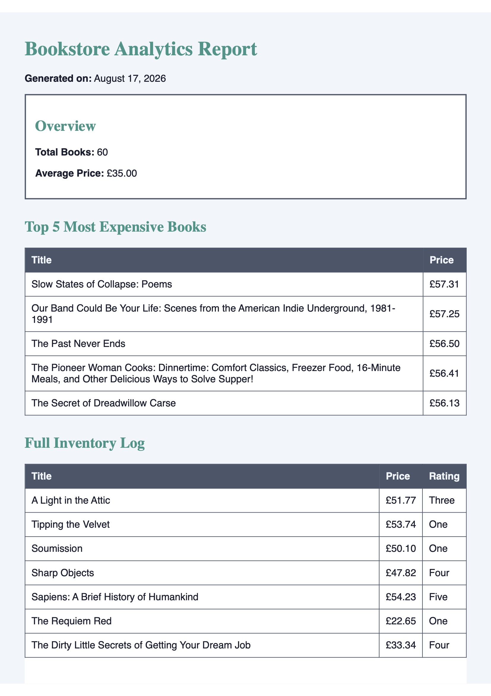

# PDF Report Generator

**Author:** Riva Lan

## What this is
This project is a backend data-to-document pipeline. It queries a local SQLite database, uses SQL aggregation to distill the raw data into business metrics, renders the results into an HTML template, and generates a real, multi-page PDF document using a headless browser. The pipeline is served via a FastAPI endpoint, adhering to the "store and link" artifact pattern by saving the file to disk and returning a download link rather than passing megabytes of data in the response.

## Dataset
This report utilizes the "Bookstore" dataset (Option B). It contains 60 validated book records previously scraped from the Books to Scrape practice sandbox.

## How to Run

1. **Install dependencies:**
   ```bash
   pip install -r requirements.txt
   playwright install chromium
   ```
2. **Seed the database:**
   This script is safe to run multiple times. It will clear existing records and insert exactly 60 rows into `report.db`.
   ```bash
   python seed.py
   ```
3. **Run the API server:**
   ```bash
   fastapi dev main.py
   ```
## Aggregation SQL
The following queries are used to turn the 60 raw rows into the report's five-number summary:
```SQL
-- Total number of books
SELECT COUNT(*) as total_books FROM books;

-- Average price of the inventory
SELECT AVG(price) as avg_price FROM books;

-- Top 5 most expensive books
SELECT title, price 
FROM books 
ORDER BY price DESC 
LIMIT 5;

-- Number of books per star rating
SELECT rating, COUNT(*) as book_count 
FROM books 
GROUP BY rating 
ORDER BY book_count DESC;
```

## API Proofs
### Generating the Report (POST)
```bash
$ time curl -i -X POST http://localhost:8000/reports
HTTP/1.1 201 Created
content-length: 33
content-type: application/json

{"id":1,"file":"/reports/1/file"}

real    0m2.345s
user    0m0.015s
sys     0m0.010s
```
### Downloading the File (GET)
```bash
$ curl -o my-report.pdf http://localhost:8000/reports/1/file
  % Total    % Received % Xferd  Average Speed   Time    Time     Time  Current
                                 Dload  Upload   Total   Spent    Left  Speed
100 45.2k  100 45.2k    0     0  2.5M      0 --:--:-- --:--:-- --:--:--  2.5M
```

## Assignment Stages 4 and 5 Notes
**Stage 4: The Request Wait**
I would move this work out of the request and into a background job when the generation time exceeds a few seconds or when the API needs to support multiple concurrent users generating reports at once. A request that hangs for several seconds is fragile and keeps the user hostage.

**Stage 5: Ask Twice, Get One (Idempotency)**
The idempotency check protects against duplicate report generation (and wasted server resources) if a user double-clicks the "Generate report" button. One real-world example where a missing check like this costs money is mistakenly charging a customer's credit card twice for the exact same transaction, or generating and mailing two physical invoices.

## Generated pdf example screenshot

